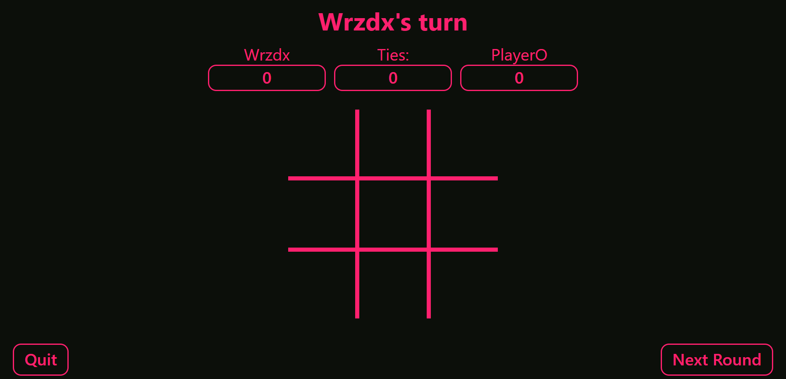

# Tic Tac Toe

A classic game built with JavaScript as part of [The Odin Project](https://www.theodinproject.com/) curriculum. Demonstrates factory functions, module pattern, and game logic implementation.

## Preview




**Live Demo**: [https://wrzdx.github.io/Tic-Tac-Toe/](https://wrzdx.github.io/Tic-Tac-Toe/)

## Features
- Score tracking
- Animated win/draw indicators
- Responsive design

## Key Concepts
✅ Factory functions  
✅ Module pattern  
✅ Game state management  
✅ DOM manipulation  

## How to Run
1. Clone the repository:
```bash
git clone https://github.com/wrzdx/Tic-Tac-Toe.git
```
2. Open `index.html` in your browser

---

*Part of The Odin Project's [JavaScript Course](https://www.theodinproject.com/lessons/node-path-javascript-tic-tac-toe)*  
*Focuses on factory functions and module pattern*
